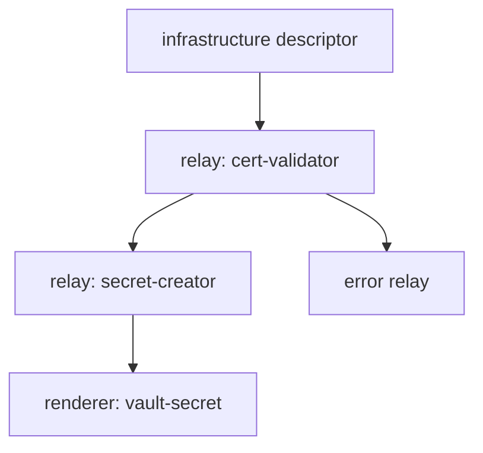

# Relay and Knowledge Graph in CIC

The CentralInfraCore (CIC) system models infrastructure, state, and execution as a **directed graph**. This graph is not merely a data structure — it is the system’s thinking model.

---

## 🧭 What is the CIC Graph?

CIC combines two conceptual layers:

* **Relay Graph**: Defines the flow and sequencing of state transitions (relay → relay → renderer)
* **Knowledge Graph**: Maps schema relationships, roles, and component logic

Together, these layers allow CIC to not just execute — but interpret.

---

## 🔁 Relay Graph

Relay nodes are connected via directed edges. Each relay:

* makes schema-driven decisions
* handles only its defined scope
* forwards processed state or errors

The graph can be:

* **linear** (simple step execution),
* **branching** (e.g., cert + secret generation),
* **reverse-directed** (error propagation upstream)

---

## 🧠 Knowledge Graph

The knowledge graph defines the conceptual and modular relationships between system entities. It includes:

* schema inheritance chains
* prompt-to-component mappings
* intersections between roles and versions

This enables both AI and human actors to:

* reach modules via prompt input
* access execution logic and state models for any object

---

## 📈 Example

---

## 🎯 Design Principle

The CIC graph is not a static pipeline — it is a **schema-bound, state-driven path resolver**. It offers flexibility while preserving verifiability and determinism.

---

*Created in collaboration with AI. Directed by structured understanding.*
