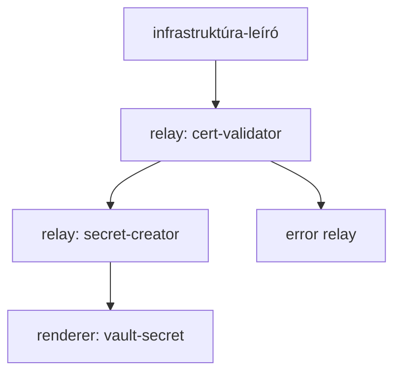

# A relé- és tudásgráf a CIC-ben

A CentralInfraCore (CIC) rendszer **irányított gráfként** kezeli az infrastruktúra leírását, állapotát és végrehajtását. Ez a gráf nem csupán adathalmaz, hanem a rendszer gondolkodási modellje is.

---

## 🧭 Mi az a CIC-gráf?

A CIC gráf két logikai síkot köt össze:

* **Relégráf**: az állapotváltozások útvonalait és sorrendiségét határozza meg (relay → relay → renderer)
* **Tudásgráf**: sémák, komponensek és szerepkörök összefüggéseit térképezi fel

E kettő együtt lehetővé teszi, hogy a rendszer ne csak végrehajtson, hanem *értelmezzen* is.

---

## 🔁 Relégráf

A relay-csomópontok irányított élként kapcsolódnak egymáshoz. Minden relé:

* sémavezérelt döntést hoz
* csak a saját felelősségi köréért felel
* továbbítja a feldolgozott állapotot vagy hibát

A gráf lehet:

* **lineáris** (egylépéses végrehajtás),
* **ágazó** (pl. tanúsítvány + titok létrehozása),
* **visszairányított** (hiba esetén relé-útvonal visszacsatolása).

---

## 🧠 Tudásgráf

A tudásgráf a rendszer fogalmainak és moduláris komponenseinek összefüggését írja le. Tartalmazza:

* sémaöröklési láncokat
* prompt–komponens kapcsolatokat
* verziók és szerepkörök metszeteit

Ez a gráf teszi lehetővé az AI és emberi értelmezők számára, hogy:

* prompton keresztül modulhoz jussanak
* egy objektumhoz tartozó állapot és végrehajtási logika elérhető legyen

---

## 📈 Példa

---

## 🎯 Tervezési elv

A CIC gráf nem fix pipeline, hanem **sémavezérelt és állapotalapú útvonalképzés**. Ez rugalmasságot ad, ugyanakkor biztosítja az ellenőrizhetőséget és determinisztikus lefutást.

---

*Készült mesterséges intelligencia együttműködésével. Irányított tudással.*
